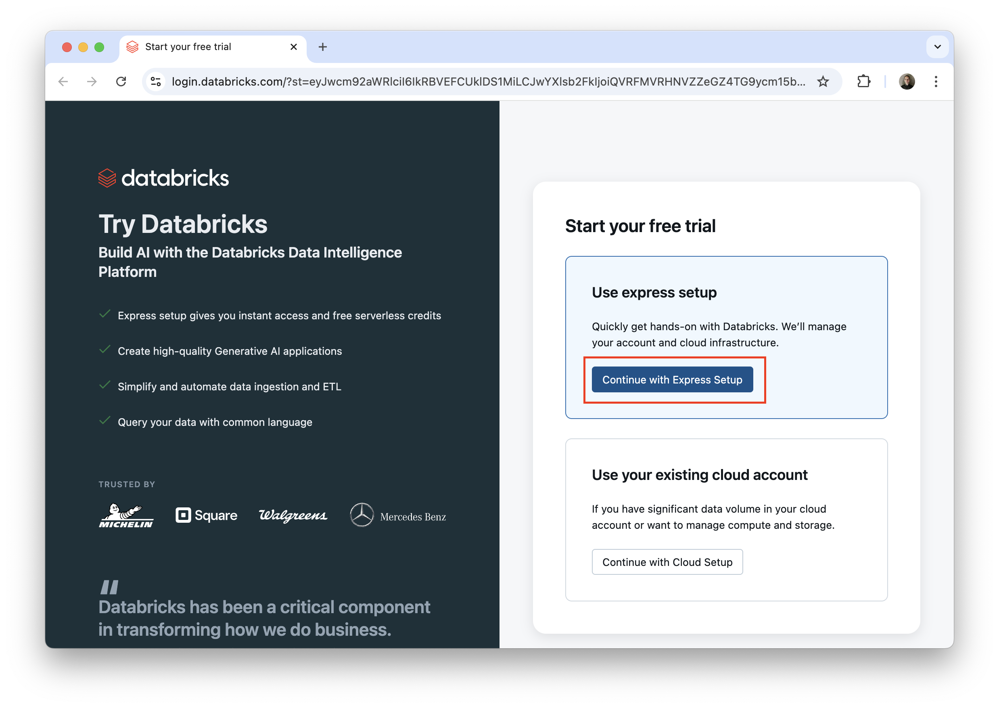
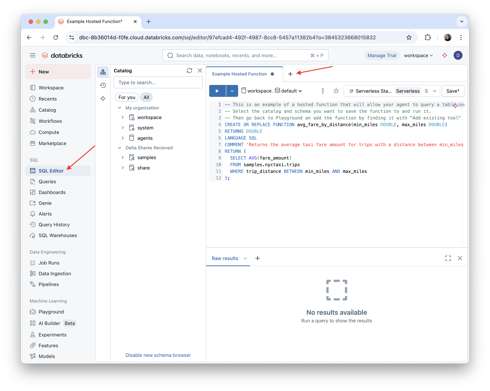
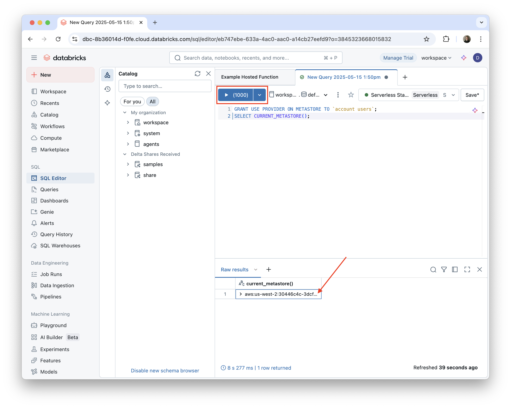
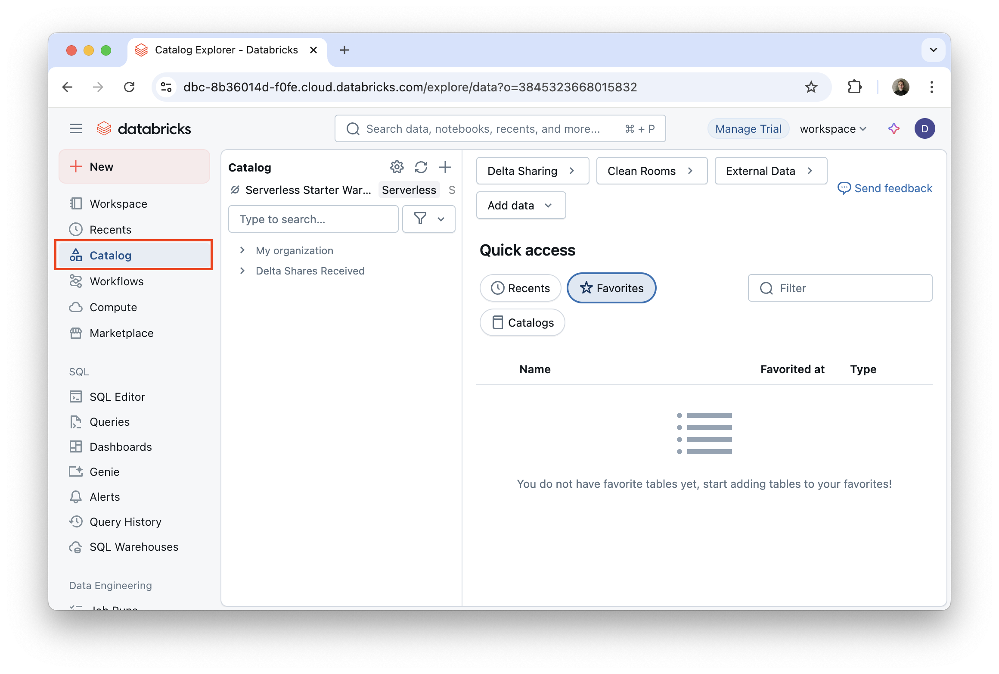
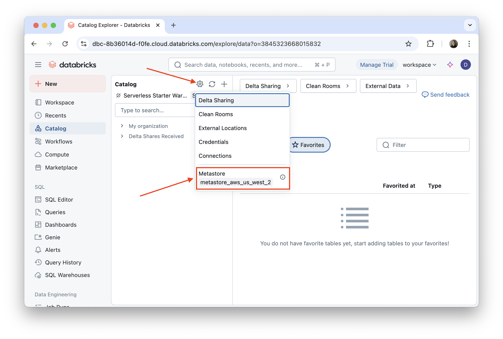
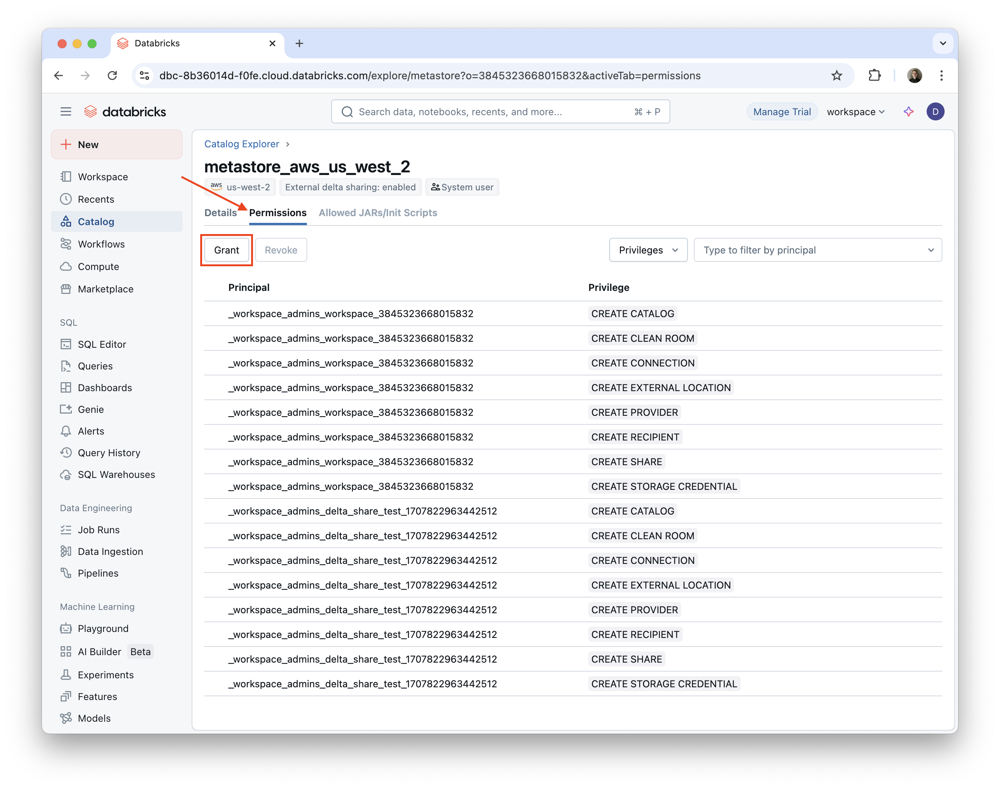
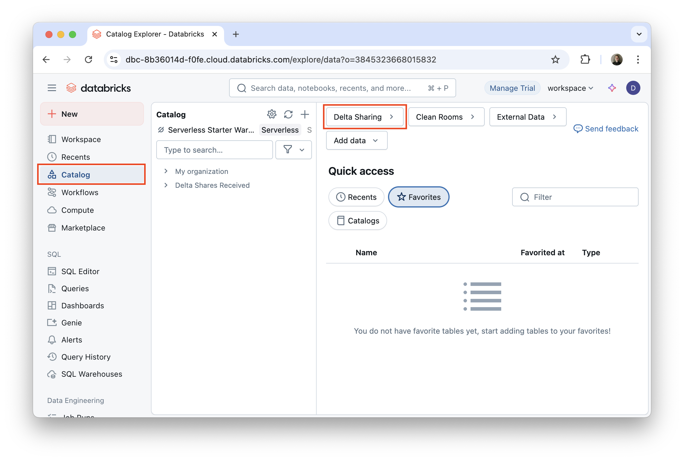
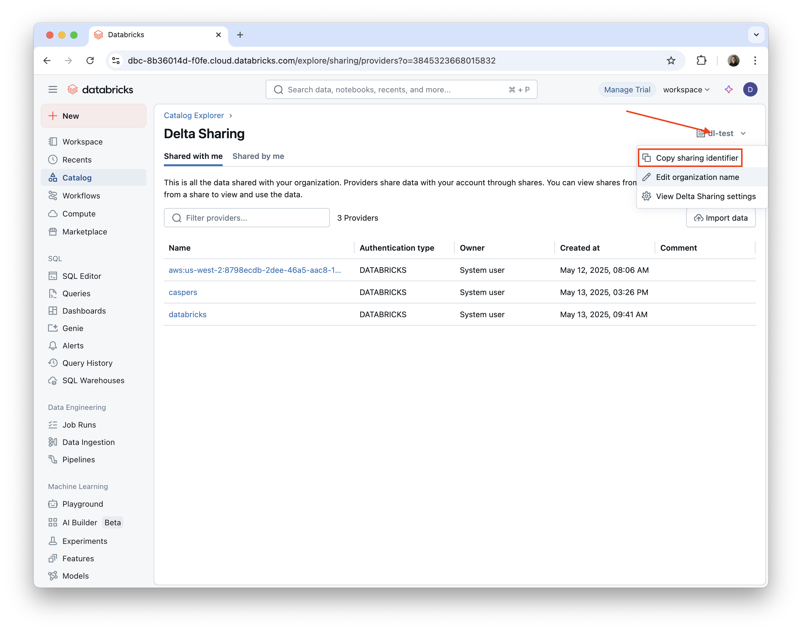
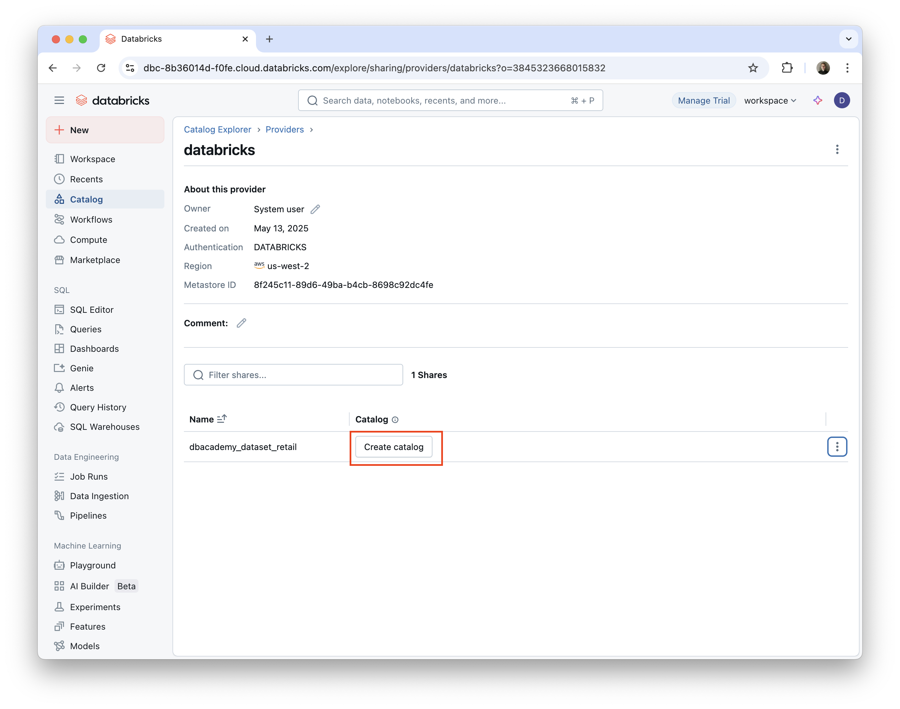

# DAIS 2025 GenAI Hackathon

This README provides a quick overview of how to get started with your Databricks workspace and how get get access to the data for the Data for Good challenges.

Here are some links to additional guides and resources to help you get started:

- [Agent Library Integrations](2025_agent_hackathon_resources/databricks_agent_library_integrations.ipynb): This notebook provides a quick overview of how to integrate models from Databricks Model Serving with the popular LlamaIndex and LangGraph libraries, and addresses some common issues you may encounter.
- [Agent Development with Databricks](2025_agent_hackathon_resources/agent_dev.ipynb): This notebook shows some of the tools, such as Tracing and Agent Evaluations, that help you build agents on Databricks.

## 1. Set Up Your Workspace and Get Data

### Setting up your Workspace

Use the provided link to get your Databricks trial account. This will be provided on the day of the hackathon.

After clicking the link, click "Continue with Express Setup."



Provide your email to create an account. We recommend using a work email address if possible. Then complete the rest of the prompts to set up your workspace.

For more details, see the [Databricks documentation](https://docs.databricks.com/aws/en/getting-started/express-setup).

### Getting the Data

Our *Data for Good* partners are providing several datasets for you to use in this hackathon. To access the data, you will need to configure your Databricks workspace to use Delta Sharing and then provide your Delta Sharing ID to the hackathon organizers. This involves two steps:

1. Granting `USE PROVIDER` privileges on your Unity Catalog metastore.
2. Obtaining your Delta Sharing ID and sharing it with the hackathon organizers.

We will show two different approaches to accomplishing these steps. The first uses Databricks SQL and the second uses the Databricks UI. Use whichever approach you are comfortable with.

#### Option 1: Using Databricks SQL (Recommended)

1. **Click the "SQL Editor" tab in the left sidebar of your Databricks workspace.**

Then click the "+" button to create a new query and select "Create new query."



2. **Paste the following SQL code into the query editor:**

```sql
GRANT USE PROVIDER ON METASTORE TO `account users`;
SELECT CURRENT_METASTORE();
```

and then click the "Run" button (the arrow icon). In the results section, copy the `current_metastore()` value. It will look like `<cloud>:<region>:<uuid>` (e.g. `aws:us-west-2:19a84bee-54bc-43a2-87de-023d0ec16016`)



Share this value with the hackathon organizers via the provided Google form. The organizers will then share the data to your Databricks account. You can find it in the Delta Sharing section of your workspace's Catalog Explorer. See the [Accessing the Data](#accessing-the-data) section for more details.

#### Option 2: Using the Databricks UI

To receive data via Delta Sharing, you will need `USE PROVIDER` privileges on your Unity Catalog metastore. To grant this, you can use the following approach:

1. **Navigate to the "Catalog" tab in the left sidebar of your Databricks workspace.**



2. **Click the gear symbol ("Manage") and select "Metastore" from the dropdown menu.**



3. **Click the "Permissions" tab and then click the "Grant" button.**



4. **Check the box next to `USE PROVIDER` and select "All Account Users" from the "Principals" dropdown menu.**


5. **Click "Grant" to set the privilege.**

For more information, see the [Delta Sharing documentation on reading shared data](https://docs.databricks.com/aws/en/delta-sharing/read-data-databricks#permissions-required).

**Obtain and Share your Delta Sharing ID**

Once you have been granted `USE PROVIDER` privileges, you can obtain your Delta Sharing ID by clicking the "Copy" button in the "Delta Sharing" section of the "Settings" tab. You will then provide this ID to the hackathon organizers via a google form that will be provided on the day of the hackathon.

1. Navigate to the "Catalog" tab in the left sidebar of your Databricks workspace and then click the "Delta Sharing" button.



2. Click your Databricks sharing organization name in the upper right, and select Copy sharing identifier.



3. Share your Delta Sharing ID with the hackathon organizers using the provided Google form.

### Accessing the Data

After we have received your Delta Sharing ID, we will share the data to your Databricks account. From the Catalog -> Delta Sharing menu, in the "Shared with me" tab, you will see the share. To use the data, click on the share name, and then click "Create catalog" next to the dataset you would like to use. This will create a new catalog in your Databricks workspace with the shared data, and you can start using it immediately.



## 2. Getting Started with the Hackathon

There are many different ways to approach this hackathon. We will provide a few different examples and links to resources that you can use to get started.

While you are free to choose your own challenge/use case, we recommend pursuing one of the following if you are looking for inspiration. You can build both of these on data and resources provided by our Data for Good partners.

- **Community Wellness & Support Navigator:** Create an agent system focused on improving individual and community well-being by making health and social support systems easier to navigate, from understanding benefits and health information to finding appropriate care pathways or resources. This could be combined with other data sources that might highlight community needs or real-time service availability, and with agents and tools to e.g. fill out forms or draft inquiries to agencies and resources. You might, for example, make an agent that helps with access to resources in a particular neighborhood or that analyzes gaps in resources and generates reports/communications for use by community advocates.
- **Accessible City & Travel Equity Agent:** Create agents that promote inclusivity by helping individuals with particular accessibility needs discover and navigate cities and travel options. You might, for example, make an agent that finds/verifies accessible lodging/attractions and drafts inquiries or simulates booking steps or that plans detailed accessible routes and generates personalized itineraries based on the user's needs.

### Demos and Examples

- You will find some demo materials in your workspace. For example, the `Build your first AI Agent` notebook and `Bakehouse Sales Starter Space` Genie space both provide a great starting point for building your own agents in Databricks.
- The [Agent Development](./agent_dev.ipynb) notebook provides a quick tour of some of the tools Databricks provides for building agents, such as MLflow tracing and Agent Evaluations.
- For lower-code approaches, consider using [AI/BI Genie Spaces](https://docs.databricks.com/aws/en/genie) and [AI builder](https://docs.databricks.com/aws/en/generative-ai/ai-builder/) to build agents.